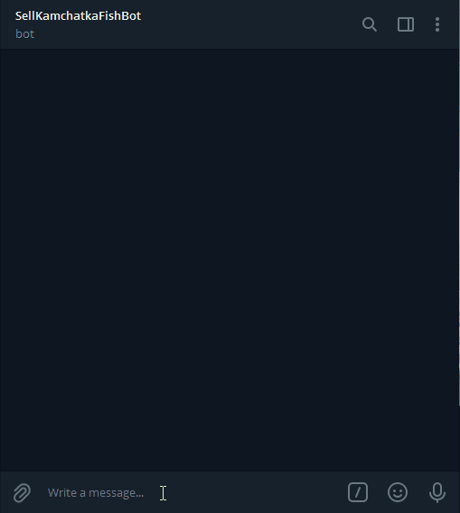

# Чат бот для покупки камчатских морепродуктов

Бот работает с api [ElasticPath](https://euwest.cm.elasticpath.com/). Позволяет просматривать описание морепродуктов с изображением,
ценой, остатком на складе, добавлять в корзину, удалять из корзины. При нажатии на кнопку Оплата запрашивается email, если он 
неверный, нужно ещё раз ввести правильный. После этого корзина обнуляется и можно повторить весь процесс сначала.


Пообщаться с ботом можно:

- в Телеграм [@SellKamchatkaFishBot](https://t.me/SellKamchatkaFishBot)


Также пример работы ботов можно посмотреть на гифке




## Как запустить

Скачайте код:
```sh
git clone https://github.com/mukhametdinovigor/sell_fish.git
```

Перейдите в каталог проекта:
```sh
cd sell_fish
```

[Установите Python](https://www.python.org/) если этого ещё не сделали.

Проверьте, что `python` установлен и корректно настроен. Запустите его в командной строке:
```sh
python --version
```

В каталоге проекта создайте виртуальное окружение:
```sh
python -m venv venv
```
Активируйте его. На разных операционных системах это делается разными командами:
- Windows: `.\venv\Scripts\activate`
- MacOS/Linux: `source venv/bin/activate`


Установите зависимости в виртуальное окружение:
```sh
pip install -r requirements.txt
```

У вас должен быть [зарегистрированный бот в Telegram](https://telegram.me/BotFather)

## Переменные окружения

Часть настроек проекта берётся из переменных окружения. Чтобы их определить, создайте файл `.env` в корне проекта
и запишите туда данные в таком формате: `ПЕРЕМЕННАЯ=значение`.

Доступны переменные:

Настройки [ElasticPath](https://euwest.cm.elasticpath.com/) необходимы для получения токена.

- `CLIENT_ID` - id клиента [ElasticPath](https://euwest.cm.elasticpath.com/)
- `CLIENT_SECRET` - пароль [ElasticPath](https://euwest.cm.elasticpath.com/) 

Настройки Telegram

- `TG_TOKEN` — токен рабочего бота в телеграм.
- `BUG_REPORTING_BOT_TOKEN` - токен бота в телеграм, куда будут отправлятся сообщения об ошибках
- `CHAT_ID` - ваш chat_id в телеграм

Настройки Redis, в базу записывается состояние бота.

- `REDIS_PASSWORD` — пароль к базе данных Redis
- `REDIS_ENDPOINT` - адрес базы данных Redis
- `REDIS_PORT` - порт  


Запустите ботов:

```sh
python tg_bot.py
```

## Цели проекта

Код написан в учебных целях на курсе по Python и веб-разработке на сайте [Devman](https://dvmn.org).
